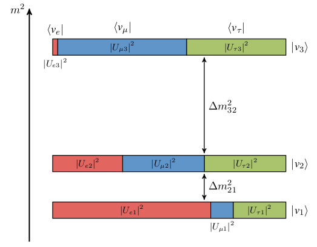
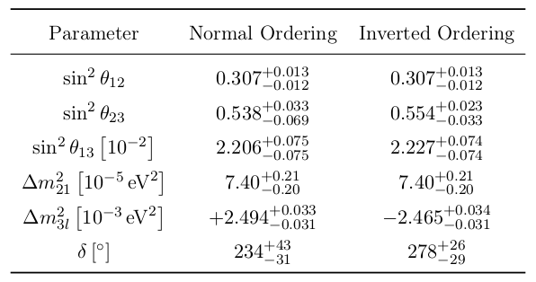
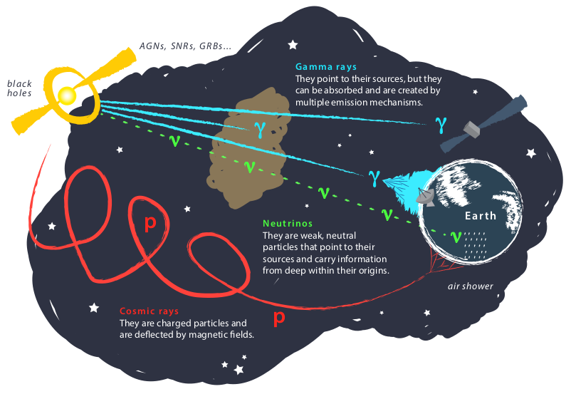
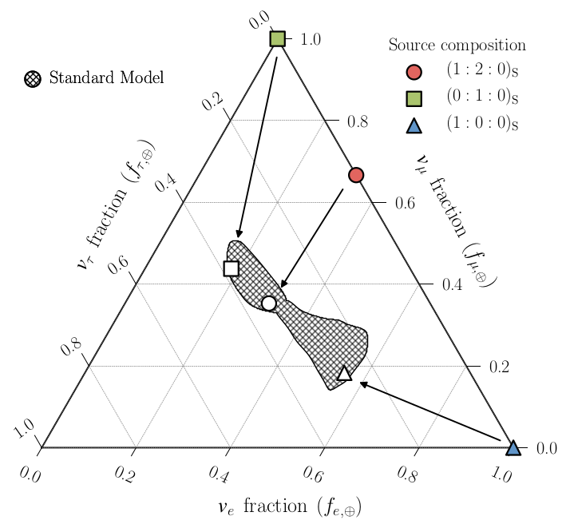
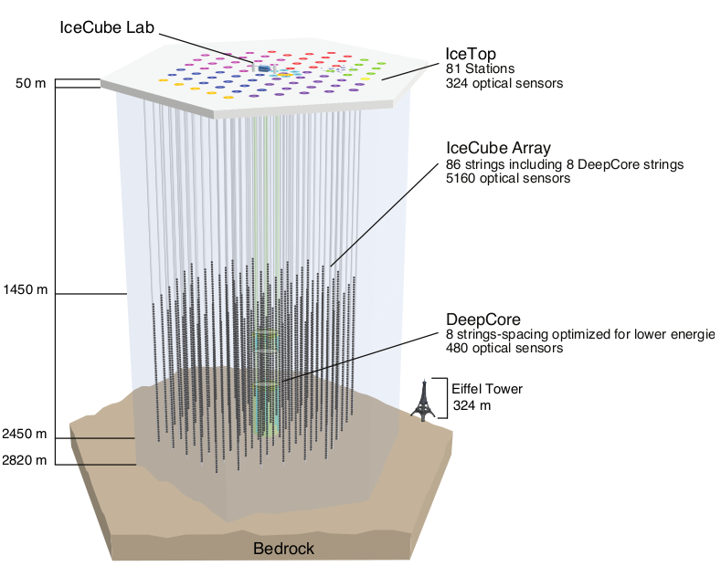
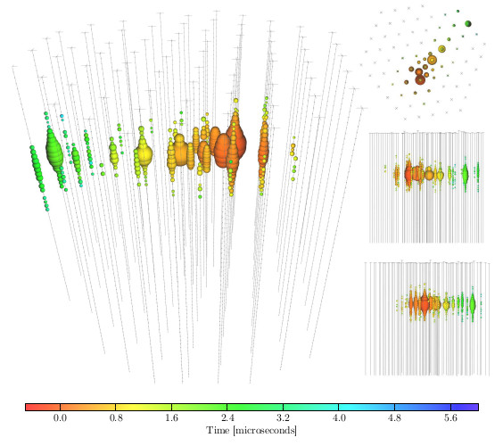
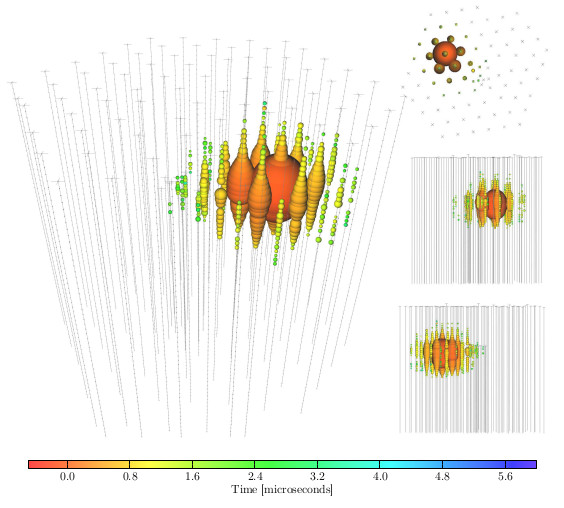

.. _physics:

:github_url: https://github.com/ShiveshM/GolemFlavor

*******
Physics
*******

Neutrinos
=========

Introduction
------------
The name *neutrino* was coined to describe a then hypothetical particle
suggested by Wolfgang Pauli in the 1930's [1]_. Pauli's idea was that of a
neutral, weakly interacting particle having a very small mass. He proposed this
particle could be used to explain the spectrum of electrons emitted by
:math:`\beta`-decays of atomic nuclei, which was of considerable controversy at
the time. The observed spectrum of these electrons is continuous [2]_, which is
incompatible with the two-body decay description successfully used to describe
discrete spectral lines in :math:`\alpha`- and :math:`\gamma`- decay of atomic
nuclei. As Pauli observed, by describing :math:`\beta`-decay as a three-body
decay instead, releasing both an electron and his proposed particle, one can
explain the continuous :math:`\beta`-decay spectrum.  Soon after discovery of
the neutron [3]_, Enrico Fermi used Pauli's light neutral particle as an
essential ingredient in his successful theory of :math:`\beta`-decay, giving
the neutrino it's name as a play on words of *little neutron* in Italian [4]_.

It was not until some 20 years later that the discovery of the neutrino was
realised. It was eventually understood that neutrinos came in three distinct
*flavours* :math:`\left (\nu_e,\nu_\mu,\nu_\tau\right )` along with their
associated antiparticles :math:`\left
(\bar{\nu}_e,\bar{\nu}_\mu,\bar{\nu}_\tau\right)`.

Neutrino Mixing
---------------
For the three massive neutrinos, the flavour eigenstates of the neutrino
:math:`\mid{\nu_\alpha}>`, :math:`\alpha\in\{e,\mu,\tau\}`, are related to the
mass eigenstates :math:`\mid{\nu_i}>`, :math:`i\in\{1,2,3\}` via a unitary
mixing matrix :math:`U_{\alpha i}` known as the PMNS matrix [5]_, [6]_:

.. math::

  \mid{\nu_\alpha}>=\sum^3_{i=1}U^*_{\alpha i}\mid{\nu_i}>

This relationship can be seen better in this image:

  Graphical representation of the relationship between the neutrino flavour and
  mass eigenstates. The three mass eigenstates are depicted as three boxes,
  coloured such that the relative area gives the probability of finding the
  corresponding flavour neutrino in that given mass state.

The time evolution of the flavour eigenstate as the neutrino propagates is
given by:

.. math::

  \mid{\nu_\alpha\left(t\right)}>=
  \sum^3_{i=1}U^*_{\alpha i}\mid{\nu_i\left(t\right)}>

The oscillation probability gives the probability that a neutrino produced in a
flavour state :math:`\alpha` is then detected in a flavour state :math:`\beta`
after a propagation distance :math:`L`:

.. math::

  \begin{align}
    P_{\nu_\alpha\rightarrow\nu_\beta}\left(L\right) &=
    \mid{<{\nu_\beta\left(L\right)}|{\nu_\alpha\left(0\right)}>}\mid^2\\
    &=\mid{\sum_{i=1}^3\sum_{j=1}^3<{\nu_j\left(L\right)}|
    U_{\beta j}U_{\alpha i}^*|{\nu_i\left(0\right)}>}\mid^2\\
    &=\mid{\sum_{i=1}^3\sum_{j=1}^3U_{\beta j}U_{\alpha i}^*
    <{\nu_j\left(0\right)}|e^{-i\frac{m_j^2L}{2E}}
    e^{-i\frac{m_i^20}{2E}}|{\nu_i\left(0\right)}>}\mid^2\\
    &=\mid{\sum_{i=1}^3U_{\beta i}U_{\alpha i}^*
    e^{-i\frac{m_i^2L}{2E}}}\mid^2
  \end{align}

where the relation :math:`<{\nu_i}|{\nu_j}>=\delta_{ij}` was used. Expanding
this expression gives [7]_:

.. math::

  \begin{align}
    P_{\nu_\alpha\rightarrow\nu_\beta}\left(L, E\right) =
    \delta_{\alpha\beta}&-4\sum_{i>j}\text{Re}\left(U_{\alpha i}^*U_{\beta i}
    U_{\alpha j}U_{\beta j}^*\right)\sin^2
    \left(\frac{\Delta m^2_{ij}L}{4E}\right)\\
    &+2\sum_{i>j}\text{Im}\left(U_{\alpha i}^*U_{\beta i}U_{\alpha j}
    U_{\beta j}^*\right)\sin\left(\frac{\Delta m^2_{ij}L}{2E}\right)
  \end{align}

where :math:`\Delta m_{ij}^2=m_i^2-m_j^2`. Note that for neutrino oscillations
to occur, there must be at least one non-zero :math:`\Delta m_{ij}^2` and
therefore there must exist at least one non-zero neutrino mass state.

The mixing matrix can be parameterised using the standard factorisation [8]_:

.. math::

  \begin{align}
    U=
    \begin{pmatrix}
      1    & 0       & 0      \\
      0    & c_{23}  & s_{23} \\
      0    & -s_{23} & c_{23} \\
    \end{pmatrix}
    \begin{pmatrix}
      c_{13}             & 0 & s_{13}e^{-i\delta} \\
      0                  & 1 & 0                  \\
      -s_{13}e^{i\delta} & 0 &c_{13}              \\
    \end{pmatrix}
    \begin{pmatrix}
      c_{12}  & s_{12} & 0 \\
      -s_{12} & c_{12} & 0 \\
      0       & 0      & 1 \\
    \end{pmatrix}
  \end{align}

where :math:`s_{ij}\equiv\sin\theta_{ij}`, :math:`c_{ij}\equiv\cos\theta_{ij}`,
:math:`\theta_{ij}` are the three mixing angles and :math:`\delta` is the CP
violating phase. Overall phases in the mixing matrix do not affect neutrino
oscillations, which only depend on quartic products, and so they have been
omitted.  Therefore, this gives a total of six independent free parameters
describing neutrino oscillations for three neutrino flavours in a vacuum. This
table outlines the current knowledge of these parameters determined by a fit to
global data [9]_:

  Three neutrino flavour oscillation parameters from a fit to global data
  [9]_.

This table shows two columns of values, *normal ordering* and *inverted
ordering* corresponding to the case where the mass of :math:`\nu_3` is greater
than the mass of :math:`\nu_1` or the mass of :math:`\nu_1` is greater than the
mass of :math:`\nu_3`, respectively. The experimental determination of this
mass ordering is ongoing.

Astrophysical Neutrinos
-----------------------
The origin and acceleration mechanism of ultra-high-energy cosmic rays is still
unknown. The difficulty comes from the fact that the cosmic rays are bent by
interstellar magnetic fields, and so their arrival direction on Earth does not
point back to their sources. The observation of these ultra-high-energy cosmic
rays supports the existence of neutrino production at the sources of a similar
energy range - an astrophysical neutrino flux. Neutrinos are electrically
neutral, so are not perturbed by interstellar magnetic fields, and they also
have a small enough interaction cross-section to escape from dense regions.
This makes them ideal messengers to help identify the sources of cosmic rays:

  Neutrinos as messengers of astrophysical objects. Exotic astrophysical
  objects produce high-energy cosmic rays, photons and neutrinos, which can be
  detected on Earth. Credit: IceCube, NSF.

Ultra-high-energy cosmic rays detected on Earth manifestly succeed in
escaping their sources, therefore these sources must be optically thin
compared to the Earth's atmosphere. Thus, the following interactions of the
accelerated protons are expected to be more important than lengthy shower
processes. High-energy protons can interact with photons as such:

.. math::

  p+\gamma\rightarrow\Delta^+\rightarrow 
  \begin{cases}
    p+\pi^0\\
    n+\pi^+
  \end{cases}

They can also interact with other hadrons:

.. math::

  p+p\rightarrow
  \begin{cases}
    p+p+\pi^0\\
    p+n+\pi^+
  \end{cases}\\
  p+n\rightarrow
  \begin{cases}
    p+n+\pi^0\\
    p+p+\pi^-
  \end{cases}

Importantly, final states here tend to produce pions which decay into either
photons if neutral, :math:`\pi^0\rightarrow\gamma\gamma`, or if they are charged
they decay into charged leptons and neutrinos. The neutral and charged pions are
produced in similar amounts, meaning that the neutrino and photon fluxes are
related. Indeed, the diffuse astrophysical neutrino flux can be estimated
through :math:`\gamma`-ray astronomy [10]_.

Point source searches of neutrinos are also being pursued. In 2017, a
multi-messenger approach which searched for :math:`\gamma`-ray observations in
coincidence with neutrinos coming from a particular source has successfully
been able to identify for the very first time, a source of high-energy
astrophysical neutrinos [11]_, [12]_.

Of particular interest is the composition of flavours produced at the source.
In the simple pion decay model described above, the *neutrino flavour
composition* (sometimes referred to as the *neutrino flavour ratio*)
produced at the source is:

.. math::

  \pi\text{ decay}\rightarrow
  \left(f_e:f_\mu:f_\tau\right)_\text{S}=\left(1:2:0\right)_\text{S}

For all discussions on the astrophysical neutrino flavour composition, the
neutrino and antineutrino fluxes will been summed over as it is not yet
experimentally possible to distinguish between the two. In the case that the
muon interacts in the source before it has a chance to decay, e.g.\@ losing
energy rapidly in strong magnetic fields or being absorbed in matter, only the
:math:`\nu_\mu` from the initial pion decay escapes and so the source flavour
composition is simply:

.. math::
  \mu\text{ suppressed }\rightarrow
  \left(f_e:f_\mu:f_\tau\right)_\text{S}=\left(0:1:0\right)_\text{S}

Another popular model is one in which the produced flux is dominated by neutron
decay, :math:`n\rightarrow p+e^-+\bar{\nu}_e`, which gives rise to a purely
:math:`\nu_e` component:

.. math::

  n\text{ decay}\rightarrow
  \left(f_e:f_\mu:f_\tau\right)_\text{S}=\left(1:0:0\right)_\text{S}

Production of :math:`\nu_\tau` at the source is not expected in standard
astrophysics models. However, even in the standard construction, the
composition could vary between any of the three idealised models above, which
can be represented as a source flavour composition of :math:`(x:1-x:0)`, where
:math:`x` is the fraction of :math:`\nu_e` and can vary between
:math:`0\rightarrow1`.

Once the neutrinos escape the source, they are free to propagate in the vacuum.
As discussed above, neutrinos can transform from one flavour to another.
Astrophysical neutrinos have :math:`\mathcal{O}(\text{Mpc})` or higher
baselines, large enough that the mass eigenstates completely decouple. The
astrophysical neutrinos detected on Earth are decoherent and are propagating in
pure mass eigenstates. Taking this assumption greatly simplifies the transition
probability as all the interference terms between the three mass eigenstates
can be dropped, and all that is left is to convert from the propagating mass
state to the flavour states:

.. math::

  \phi_{i,\oplus}&=\sum_\alpha\phi_{\alpha,\text{S}}\mid{U_{\alpha i}}\mid^2\\
  \phi_{\alpha,\oplus}&=\sum_{i,\beta}
    \mid{U_{\alpha i}}\mid^2\mid{U_{\beta i}}\mid^2\phi_{\beta,\text{S}}

where :math:`\phi_\alpha` is the flux for a neutrino flavour :math:`\nu_\alpha`
and :math:`\phi_i` is the flux for a neutrino mass state :math:`\nu_i`. The
subscript :math:`\text{S}` denotes the source and :math:`\oplus` denotes as
measured on Earth. The same result can be obtained in the plane wave picture of
the neutrino mixing equations above and taking the limit
:math:`L\rightarrow\infty`, thus this type of decoherent mixing is also known
as oscillation-averaged neutrino mixing. From this, the flavour composition on
Earth is defined as
:math:`f_{\alpha,\oplus}=\phi_{\alpha,\oplus}/\sum_\alpha\phi_{\alpha,\oplus}`
and this can be calculated using the mixing matrix parameters the table above.
For the three source models discussed above:

.. math::

  \begin{align}
    \left(1:2:0\right)_\text{S}&\rightarrow\left(0.31:0.35:0.34\right)_\oplus\\
    \left(0:1:0\right)_\text{S}&\rightarrow\left(0.18:0.44:0.38\right)_\oplus\\
    \left(1:0:0\right)_\text{S}&\rightarrow\left(0.55:0.18:0.27\right)_\oplus
  \end{align}

This can be visualised in a ternary plot, which you can make yourself by
checking out the :doc:`examples` section! The axes here are the fraction of
each neutrino flavour as shown below. The coloured circle, square and triangle
show the source flavour compositions. The arrows show the effect of neutrino
mixing on the flavour composition. The unfilled circle, square and triangle
show the corresponding measured flavour composition. Neutrino mixing during
propagation has the effect of averaging out the flavour contributions, which is
why the arrows point towards the centre of the triangle. This effect is more
pronounced for :math:`\nu_\mu\leftrightarrow\nu_\tau` due to the their larger
mixings. Also shown on this figure in the hatched *Standard Model* area, is the
region of measured flavour compositions containing all source models of
:math:`\left(x:1-x:0\right)`, using Gaussian priors on the standard mixing
angles. Therefore, this hatched area is the region in which all standard
astrophysical models live.

  Astrophysical neutrino flavour composition ternary plot. Axes show the
  fraction of each neutrino flavour. Coloured shapes show 3 models for the
  source flavour composition. The arrows indicate the effect of neutrino mixing
  during propagation and the unfilled shapes show the corresponding measured
  flavour compositions. The hatched area shows the region in measured flavour
  space in which all standard astrophysical models live.

IceCube
=======

Introduction
----------------
The `IceCube Neutrino Obervatory <https://icecube.wisc.edu/>`_ is a cubic
kilometre photomultiplier array embedded in the extremely thick and clear
glacial ice located near the geographic South Pole in Antarctica. The IceCube
array is made up of 5160 purpose built *Digital Optical Modules* (DOMs) which
are deployed on 86 cables between 1450 and 2450 m below the ground. The
interaction of a neutrino releases a burst of light in the detector, which is
detected by this array of DOMs. The timing and intensity of these photons form
the raw data set at IceCube. This data is analysed so that we can learn more
about the properties of neutrinos. You can checkout some cool animations of how
an event looks like in IceCube on `this website
<https://www.nsf.gov/news/mmg/mmg_disp.jsp?med_id=184062>`_.

A schematic layout of IceCube is shown below. The IceCube *In-Ice* array is
made up of 5160 purpose built *Digital Optical Modules* (DOMs) which are
deployed on 86 *strings* (or cables) between 1450 and 2450 m below the ground.
The inner string separation is 125 m with a vertical DOM separation of 17 m.
Eight of the centrally located strings make up the subarray *DeepCore* which
are sensitive to lower energy neutrinos. It achieves this through denser
instrumentation, having an inner string separation of 60 m and a vertical DOM
separation of 7 m. A surface air shower array, IceTop, is instrumented on the
surface and consists of a set of frozen water tanks which act as a veto against
the background cosmic rays.

  The IceCube neutrino observatory with the In-Ice array, its subarray DeepCore
  and the cosmic ray shower array IceTop.

Event Signatures
----------------
Cherenkov telescope arrays such as IceCube are able to classify the properties
of a neutrino event by looking at the morphology of photon hits across its PMT
array. There are two main types of neutrino event signatures at IceCube -
*tracks* and *cascades*.

Tracks are predominantly made by muons which are directly produced by
neutrinos in the *charged current* :math:`\nu_\mu` interaction channel. Muons
have a long lifetime, :math:`\sim` 2 :math:`\mu` s at rest, and in ice they
have relatively low energy losses. Therefore, as shown in in the figure below,
a high-energy muon travelling through the IceCube array will leave a long trail
of hits. These features, along with the timing information of hits across the
DOMs, help in determining the directionality of the muon, giving an angular
resolution typically around :math:`0.5-1^\circ` [13]_. At energies of concern
here, there is little deviation between the direction of the neutrino and the
induced muon as they are both heavily boosted. Therefore, this pointing ability
of tracks makes them the most attractive events to use for point source
searches.  Energy reconstruction is more complicated, however. At the lower
energies (:math:`\lesssim100` GeV), the muon's range is short enough that it is
able to deposit all its energy inside the detector. This is the ideal situation
for a good energy reconstruction as the IceCube array acts as a calorimeter, so
the total deposited charge is proportional to the energy of the muon. At higher
energies, the range of the muon is typically greater than the length of the
detector. Therefore the energy of muon must be extrapolated from the portion of
energy deposited inside the detector. This is particularly challenging for
muons which are not produced inside the detector, for which only a lower bound
can be made. The typical approach taken to reconstruct the muon is to segment
the reconstruction along the track. In this way, biases from stochastic
variations of the energy loss can be minimised by applying some averaging over
each segment. In each segment, the mean :math:`\text{d} E/\text{d} x` is
determined, which is then roughly proportional to the muon momentum. The energy
resolution improves with the muon energy up to an uncertainty of a factor of 2
[14]_. For more details on this see the IceCube energy reconstruction methods
publication [15]_.

  A track event initiated by a CC muon neutrino interaction in the detector.
  The muon deposits 74 TeV before escaping.

Cascades are created as a result of hadronic cascades and/or EM cascades.
*Neutral current* interactions and CC :math:`\nu_e` interactions are the
channels in which a pure cascade is created, and an example of one is shown in
the figure below. However, this does not mean that neutrino events produce
exclusively one type of signature, in fact all high-energy neutrino-nucleon
events produce at least a hadronic cascade at the interaction vertex.
Characteristic of a cascade is the isotropic deposition of energy in a
localised region near the neutrino vertex. Contrary to tracks, cascade events
have much shorter typical lengths and so the entire energy deposition is easily
contained within the detector array. This is ideal for energy reconstruction
giving a deposited energy resolution of :math:`\sim` 15% at neutrino energies
above 10 TeV [15]_. Inferring the true neutrino energy is more difficult,
however, as IceCube is not capable of resolving the difference between EM
showers and hadronic showers, which potentially have a large amount of missing
energy, leading to :math:`\sim` 15% lower light yield compared to an equivalent
EM shower. Deposited energy is reconstructed using an EM shower hypothesis, and
therefore this quantity gives the lower limit of the neutrino energy.
Directional reconstruction is more challenging than for tracks and is done by
looking for timing/light intensity anisotropies around the interaction vertex.
The deviations are small, but it is expected that the light deposition in the
forward direction is greater.  Typical angular resolutions are
:math:`10-15^\circ` [16]_.

  A cascade event initiated by a neutrino interaction in the detector. The
  cascade deposits 1070 TeV in the detector.

Not mentioned so far are the charged current :math:`\nu_\tau` interactions,
which for energies :math:`\gtrsim` 1 PeV, can produce :math:`\tau` which
travels a detectable distance before decaying. This provides a unique signature
for such events. The initial :math:`\nu_\tau` interaction produces a hadronic
cascade, followed by a track by the :math:`\tau` itself, in turn followed by
either a track from the :math:`\tau`'s muonic decay
(:math:`\tau^-\rightarrow\mu^-\bar{\nu}_\mu\nu_\tau` with branching ratio
:math:`\sim` 17%), or a cascade from its other decays. Because of their
distinctive signatures, such events are called *double bangs* or *double
cascades*. See [17]_, [18]_ for more details.

.. [1] Pauli, W. *Letter to Tübingen conference participants* Web document. 1930.
.. [2] Chadwick, J. Intensitätsverteilung im magnetischen Spectrum der :math:`\beta`-Strahlen von radium B + C. Verhandl. Dtsc. Phys. Ges. 16, 383 (1914).
.. [3] Chadwick, J. Possible Existence of a Neutron. Nature 129, 312 (1932).
.. [4] Fermi, E. An attempt of a theory of beta radiation. 1. Z. Phys. 88, 161–177 (1934).
.. [5] Pontecorvo, B. Neutrino Experiments and the Problem of Conservation of Leptonic Charge. Sov. Phys. JETP 26. [Zh. Eksp. Teor. Fiz.53,1717(1967)], 984–988 (1968).
.. [6] Maki, Z., Nakagawa, M. & Sakata, S. Remarks on the unified model of elementary particles. Prog. Theor. Phys. 28. [,34(1962)], 870–880 (1962).
.. [7] Giunti, C. & Kim, C. W. Fundamentals of Neutrino Physics and Astrophysics isbn: 9780198508717 (2007).
.. [8] Beringer, J. et al. Review of Particle Physics (RPP). Phys. Rev. D86, 010001 (2012).
.. [9] Esteban, I., Gonzalez-Garcia, M. C., Maltoni, M., Martinez-Soler, I. & Schwetz, T.  Updated fit to three neutrino mixing: exploring the accelerator-reactor complemen- tarity. JHEP 01, 087 (2017).
.. [10] Kappes, A., Hinton, J., Stegmann, C. & Aharonian, F. A. Potential Neutrino Signals from Galactic Gamma-Ray Sources. Astrophys. J. 656. [Erratum: Astrophys. J.661,1348(2007)], 870–896 (2007).
.. [11] Aartsen, M. G. et al. Multimessenger observations of a flaring blazar coincident with high-energy neutrino IceCube-170922A. Science 361, eaat1378 (2018).
.. [12] Aartsen, M. G. et al. Neutrino emission from the direction of the blazar TXS 0506+056 prior to the IceCube-170922A alert. Science 361, 147–151 (2018).
.. [13] Aartsen, M. G. et al. All-sky Search for Time-integrated Neutrino Emission from Astrophysical Sources with 7 yr of IceCube Data. Astrophys. J. 835, 151 (2017).
.. [14] Weaver, C. Evidence for Astrophysical Muon Neutrinos from the Northern Sky PhD thesis (Wisconsin U., Madison, 2015). https://docushare.icecube.wisc.edu/dsweb/Get/Document-73829/.
.. [15] Aartsen, M. G. et al. Energy Reconstruction Methods in the IceCube Neutrino Telescope. JINST 9, P03009 (2014).
.. [16] Aartsen, M. G. et al. Evidence for High-Energy Extraterrestrial Neutrinos at the IceCube Detector. Science 342, 1242856 (2013).
.. [17] Hallen, P. On the Measurement of High-Energy Tau Neutrinos with IceCube PhD thesis (RWTH Aachen University, 2013). https://www.institut3b.physik.rwth-aachen.de/global/show_document.asp?id=aaaaaaaaaapwhzq.
.. [18] Xu, D. L. Search for astrophysical tau neutrinos in three years of IceCube data PhD thesis (The University of Alabama, 2015). http://acumen.lib.ua.edu/content/u0015/0000001/0001906/u0015_0000001_0001906.pdf
