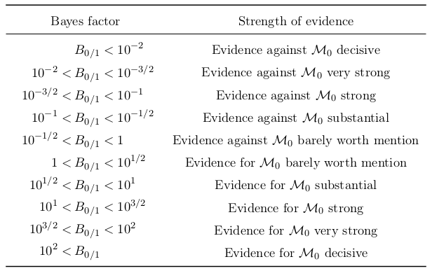
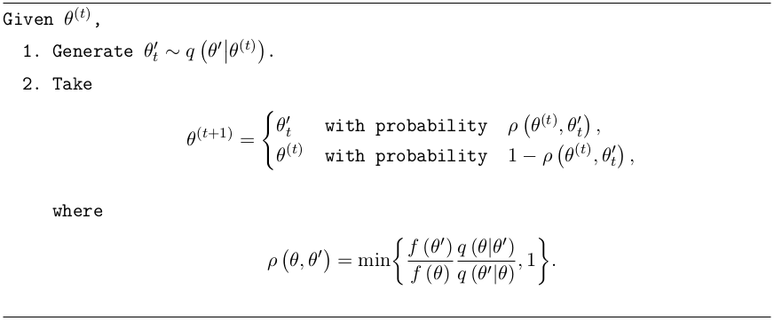

.. _statistics:

:github_url: https://github.com/ShiveshM/GolemFlavor

**********
Statistics
**********
Data is stochastic in nature, so an experimenter uses statistical methods on a
data sample :math:`\textbf{x}` to make inferences about unknown parameters
:math:`\mathbf{\theta}` of a probabilistic model of the data
:math:`f\left(\textbf{x}\middle|\mathbf{\theta}\right)`. The *likelihood
principle* describes a function of the parameters :math:`\mathbf{\theta}`,
determined by the observed sample, that contains all the information about
:math:`\mathbf{\theta}` that is available from the sample. Given
:math:`\textbf{x}` is observed and is distributed according to a joint
*probability distribution function* (PDF),
:math:`f\left(\textbf{x}\middle|\mathbf{\theta}\right)`, the function of
:math:`\mathbf{\theta}` which is defined by

.. math::

  L\left(\mathbf{\theta}\middle|\textbf{x}\right)\equiv
    f\left(\textbf{x}\middle|\mathbf{\theta}\right)

is called the *likelihood function* [1]_. If the data :math:`\textbf{x}` consists
of independent and identically distributed values, then:

.. math::

    L\left(\mathbf{\theta}\middle|\textbf{x}\right)=
    L\left(\theta_1,\dots,\theta_k\middle|x_1,\dots,x_n\right)=
    \prod_{i=1}^{n}f\left(x_i\middle|\theta_1,\dots,\theta_k\right)

Classical Statistics
--------------------
First we will take a look at the classical approach to statistics, so that we
can then compare against the Bayesian approach. The *maximum likelihood
estimators* (MLE) of the parameters :math:`\mathbf{\theta}`, denoted by
:math:`\mathbf{\hat\theta}(\textbf{x})`, are attained by maximising
:math:`L\left(\mathbf{\theta}\middle|\textbf{x}\right)`.

Often, not all the model parameters are of direct inferential interest however
they are included as they may reduce the effect of systematic bias. These are
called the nuisance parameters, :math:`\mathbf{\theta}_\nu`. To reduce the
impact of the nuisance parameters, prior knowledge based on past measurements
:math:`\textbf{y}` may be included in the likelihood:

.. math::

    L\left(\mathbf{\theta}_I,\mathbf{\theta}_\nu\middle|\textbf{x},\textbf{y}\right)=
      \prod_{i=1}^Nf_I\left(x_i\middle|\mathbf{\theta}_I\right)\cdot
      f_\nu\left(\textbf{y}\middle| \mathbf{\theta}_\nu\right)

By finding the MLE for the nuisance parameters,
:math:`\mathbf{\hat\theta}_{\nu}(\textbf{y})`, the *profile likelihood* can be written
in terms independent of :math:`\mathbf{\theta}_\nu`:

.. math::

    L_P\left(\mathbf{\theta}_I\middle|\textbf{x},\textbf{y}\right)=
    L\left(\mathbf{\theta}_I,\mathbf{\hat\theta}_{\nu}\left(\textbf{y}\right)\middle|\textbf{x},\textbf{y}\right)

The key method of inference in physics is *hypothesis testing*. The two
complementary hypotheses in a hypothesis testing problem are called the *null
hypothesis* and the *alternative hypothesis*. The goal of a hypothesis test is
to decide, based on a sample of data, which of the two complementary hypotheses
is preferred. The general format of the null and alternative hypothesis is
:math:`H_0:\mathbf{\theta}\in\Theta_0` and
:math:`H_1:\mathbf{\theta}\in\Theta_0^c`, where :math:`\Theta_0` is some subset
of the parameter space and :math:`\Theta_0^c` is its complement.  Typically, a
hypothesis test is specified in terms of a *test statistic* (TS) which is used
to define the *rejection region*, which is the region in which the null
hypothesis can be rejected.  The Neyman-Pearson lemma [2]_ then states that the
*likelihood ratio test* (LRT) statistic is the most powerful test statistic:

.. math::

    \lambda\left(\textbf{x}\right)=\frac{L\left(\mathbf{\hat\theta}_{0}\middle|
      \textbf{x}\right)}{L\left(\mathbf{\hat\theta}\middle|\textbf{x}\right)}

where :math:`\mathbf{\hat\theta}` is a MLE of :math:`\mathbf{\theta}` and
:math:`\mathbf{\hat\theta}_{0}` is a MLE of :math:`\theta` obtained by doing a
restricted maximisation, assuming :math:`\Theta_0` is the parameter space. The
effect of nuisance parameters can be included by substituting the likelihood
with the profile likelihood :math:`L\rightarrow L_P`. The rejection region then
has the form
:math:`R\left(\mathbf{\theta}_0\right)=\{\textbf{x}:\lambda\left(\textbf{x}\right)
\leq{c}\left(\alpha\right)\}`, such that
:math:`P_{\mathbf{\theta}_0}\left(\textbf{x}\in
R\left(\mathbf{\theta}_0\right)\right)\leq\alpha`, where :math:`\alpha`
satisfies :math:`0\leq{\alpha}\leq 1` and is called the *size* or
*significance level* of the test and is specified prior to the
experiment. Typically in high-energy physics the level of significance where an
effect is said to qualify as a discovery is at the :math:`5\sigma` level,
corresponding to an :math:`\alpha` of :math:`2.87\times10^{-7}`. In a binned
analysis, the distribution of :math:`\lambda\left(\textbf{n}\right)` can be
approximated by generating mock data or *realisations* of the null
hypothesis.  However, this can be computationally difficult to perform.
Instead, according to Wilks' theorem [3]_, for sufficiently large
:math:`\textbf{x}` and provided certain regularity conditions are met (MLE
exists and is unique), :math:`-2\ln\lambda\left(\textbf{x}\right)` can be
approximated to follow a :math:`\chi^2` distribution. The :math:`\chi^2`
distribution is parameterized by :math:`k`, the *number of degrees of
freedom*, which is defined as the number of independent normally distributed
variables that were summed together. When the profile likelihood is used to
account for :math:`n` nuisance parameters, the effective number of degrees of
freedom will be reduced to :math:`k-n`, due to additional constraints placed
via profiling. From this, :math:`c\left(\alpha\right)`  can be easily obtained
from :math:`\chi^2` *cumulative distribution function* (CDF) lookup
tables.

As shown so far, the LRT informs on the best fit point of parameters
:math:`\mathbf{\theta}`. In addition to this point estimator, some sort of
*interval* estimator is also useful to report to reflect its statistical
precision. Interval estimators together with a measure of confidence are also
known as *confidence intervals* which has the important property of *coverage*.
The purpose of using an interval estimator is to have some guarantee of
capturing the parameter of interest, quantified by the coverage coefficient,
:math:`1-\alpha`. In this classical approach, one needs to keep in mind that
the interval is the random quantity, not the parameter - which is fixed. Since
we do not know the value of :math:`\theta`, we can only guarantee a coverage
probability equal to the *confidence coefficient*. There is a strong
correspondence between hypothesis testing and interval estimation. The
hypothesis test fixes the parameter and asks what sample values (the acceptance
region) are consistent with that fixed value.  The interval estimation fixes
the sample value and asks what parameter values (the confidence interval) make
this sample value most plausible. This can be written in terms of the LRT
statistic:

.. math::

  \lambda\left(\mathbf{\theta}\right)=\frac{L\left(\mathbf{\theta}\middle|\textbf{x}
    \right)}{L\left(\mathbf{\hat\theta}\middle|\textbf{x}\right)}

The confidence interval is then formed as
:math:`C\left(\textbf{x}\right)=\{\mathbf{
\theta}:\lambda\left(\mathbf{\theta}\right)\geq c\left(1-\alpha\right)\}`, such
that :math:`P_{\mathbf{\theta}}\left(\mathbf{\theta}\in
C\left(\textbf{x}\right)\right)\geq1-\alpha`.  Assuming Wilks' theorem holds,
this can be written more specifically as
:math:`C\left(\textbf{x}\right)=\{\mathbf{\theta}:-2\ln\lambda\left(
\mathbf{\theta}\right) \leq\text{CDF}_{\chi^2}^{-1}\left(k,1-\alpha\right)\}`,
where :math:`\text{CDF}_{\chi^2}^{-1}` is the inverse CDF for a :math:`\chi^2`
distribution. One again, the effect of nuisance parameters can be accounted
for by using the profile likelihood analogously to hypothesis testing.

Bayesian Statistics
-------------------
The Bayesian approach to statistics is fundamentally different to the
classical (*frequentist*) approach that has been taken so far. In the
classical approach the parameter :math:`\theta` is thought to be an unknown, but
fixed quantity. In a Bayesian approach, :math:`\theta` is considered to be a
quantity whose variation can be described by a probability distribution
(called the *prior distribution*), which is subjective based on the
experimenter's belief. The Bayesian approach is also different in terms of
computation, whereby the classical approach consists of optimisation problems
(finding maxima), the Bayesian approach often results in integration
problems.

In this approach, when an experiment is performed it updates the prior
distribution with new information. The updated prior is called the
*posterior distribution* and is computed through the use of Bayes'
Theorem [4]_:

.. math::

  \pi\left(\mathbf{\theta}\middle|\textbf{x}\right)=
  \frac{f\left(\textbf{x}\middle|\mathbf{\theta}\right)
  \pi\left(\mathbf{\theta}\right)}{m\left(\textbf{x}\right)}

where :math:`\pi\left(\mathbf{\theta}\middle|\textbf{x}\right)` is the
posterior distribution,
:math:`f\left(\textbf{x}\middle|\mathbf{\theta}\right)\equiv
L\left(\mathbf{\theta}\middle|\textbf{x}\right)` is the likelihood,
:math:`\pi\left(\mathbf{\theta}\right)` is the prior distribution and
:math:`m\left(\textbf{x}\right)` is the *marginal distribution*,

.. math::

  m\left(\textbf{x}\right)=\int f\left(\textbf{x}\middle|\mathbf{\theta}\right)\pi\left(
    \mathbf{\theta}\right)\text{d}\mathbf{\theta}

The *maximum a posteriori probability* (MAP) estimate of the parameters
:math:`\mathbf{\theta}`, denoted by
:math:`\mathbf{\hat\theta}_\text{MAP}\left(\textbf{x} \right)` are attained by
maximising :math:`\pi\left(\mathbf{\theta}\middle|\textbf{x} \right)`. This
estimator can be interpreted as an analogue of the MLE for Bayesian estimation,
where the distribution has become the posterior.  An important distinction to
make from the classical approach is in the treatment of the nuisance
parameters. The priors on :math:`\theta_\nu` are naturally included as part of
the prior distribution :math:`\pi\left(\mathbf{\theta}_\nu\right)=
\pi\left(\mathbf{\theta}_\nu\middle|\textbf{y}\right)` based on a past
measurement :math:`\textbf{y}`. Then the posterior distribution can be obtained
for :math:`\theta_I` alone by *marginalising* over the nuisance parameters:

.. math::
  \pi\left(\mathbf{\theta}_I\middle|\textbf{x}\right)=\int \pi\left(\mathbf{\theta}_I,\mathbf{\theta}_\nu\middle|\textbf{x}\right)\text{d}\mathbf{\theta}_\nu

In contrast to the classical approach, where an interval is said to have
coverage of the parameter :math:`\theta`, the Bayesian approach allows one to
say that :math:`\theta` is inside the interval with a probability
:math:`1-\beta`. This distinction is emphasised by referring to Bayesian
intervals as *credible intervals* and :math:`\beta` is referred to here as the
*credible coefficient*. Therefore, both the interpretation and construction is
more straightforward than for the classical approach. The credible interval is
formed as:

.. math::
  \pi\left(\mathbf{\theta}\in A\middle|\textbf{x}\right)=\int_A\pi\left(
    \mathbf{\theta}\middle|\textbf{x}\right)\text{d}\mathbf{\theta}\geq1-\beta

This does not uniquely specify the credible interval however. The most useful
convention when working in high dimensions is the *Highest Posterior Density*
(HPD) credible interval. Here the interval is constructed such that the
posterior meets a minimum threshold :math:`A\left(\textbf{x}\right)=\{\mathbf{
\theta}:\pi\left(\mathbf{\theta}\middle|\textbf{x}\right)\geq
t\left(1-\beta\right)\}`. This can be seen as an interval starting at the MAP,
growing to include an area whose integrated probability is equal to
:math:`\beta` and where all points inside the interval have a higher posterior
value than all points outside the interval.

In the Bayesian approach, hypothesis testing can be generalised further to
*model selection* in which possible models (or hypotheses)
:math:`\mathcal{M}_0,\mathcal{M}_1,\dots,\mathcal{M}_k` of the data
:math:`\textbf{x}` can be compared. This is again done through Bayes theorem
where the posterior probability that :math:`\textbf{x}` originates from a model
:math:`\mathcal{M}_j` is

.. math::

  \pi\left(\mathcal{M}_j\middle|\textbf{x}\right)=\frac{
  f\left(\textbf{x}\middle|\mathcal{M}_j\right)\pi\left(\mathcal{M}_j\right)}{
  M\left(\textbf{x}\right)}\quad\text{where}\quad
  M\left(\textbf{x}\right)=\sum_{i=0}^kf\left(\textbf{x}\middle|\mathcal{M}_i\right)
  \pi\left(\mathcal{M}_i\right)

the likelihood of the model
:math:`f\left(\textbf{x}\middle|\mathcal{M}_j\right)` can then be written as
the marginal distribution over model parameters :math:`\mathbf{\theta}_j`, also
referred to as the *evidence* of a particular model:

.. math::

  \mathcal{Z}_j\left(\textbf{x}\right)=f\left(\textbf{x}\middle|\mathcal{M}_j\right)=
  \int f_j\left(\textbf{x}\middle|\mathbf{\theta}_j\right)
  \pi_j\left(\mathbf{\theta}_j\right)\text{d}\mathbf{\theta}_j

This was seen before as just a normalization constant above; however, this
quantity is central in Bayesian model selection, which for two models
:math:`\mathcal{M}_0` and :math:`\mathcal{M}_1` is realised through the ratio
of the posteriors:

.. math::

  \frac{\pi\left(\mathcal{M}_0\middle|\textbf{x}\right)}
  {\pi\left(\mathcal{M}_1\middle|\textbf{x}\right)}=B_{\,0/1}\left(\textbf{x}\right)
  \frac{\pi\left(\mathcal{M}_0\right)}{\pi\left(\mathcal{M}_1\right)}\quad
  \text{where}\quad B_{\,0/1}\left(\textbf{x}\right)=
  \frac{\mathcal{Z}_0\left(\textbf{x}\right)}{\mathcal{Z}_1\left(\textbf{x}\right)}

here we denote the quantity :math:`B_{\,0/1}\left(\textbf{x}\right)` as the
*Bayes factor* which measures the relative evidence of each model and
can be reported independent of the prior on the model. It can be interpreted
as the *strength of evidence* for a particular model and a convention
formulated by Jeffreys [5]_ is one way to interpret this
inference, as shown here:

  List of Bayes factors and their inference convention according to Jeffreys'
  scale [5]_.

Markov Chain Monte Carlo
------------------------
The goal of a Bayesian inference is to maintain the full posterior probability
distribution. The models in question may contain a large number of parameters
and so such a large dimensionality makes analytical evaluations and
integrations of the posterior distribution unfeasible. Instead the posterior
distribution can be approximated using *Markov Chain Monte Carlo* (MCMC)
sampling algorithms. As the name suggests these are based on *Markov chains*
which describe a sequence of random variables :math:`\Theta_0,\Theta_1,\dots`
that can be thought of as evolving over time, with probability of transition
depending on the immediate past variable, :math:`P\left(\Theta_{k+1}\in
A\middle|\theta_0,\theta_1,\dots,\theta_k\right)= P\left(\Theta_{k+1}\in
A\middle|\theta_k\right)` [6]_. In an MCMC algorithm, Markov chains are
generated by a simulation of *walkers* which randomly walk the parameter space
according to an algorithm such that the distribution of the chains
asymptotically reaches a *target density* :math:`f\left(\theta\right)` that is
unique and stationary (i.e. no longer evolving). This technique is
particularly useful as the chains generated for the posterior distribution can
automatically provide the chains of any marginalised distribution, e.g. a
marginalisation over any or all of the nuisance parameters.

The *Metropolis-Hastings* (MH) algorithm [7]_ is the most well known MCMC
algorithm and is shown in this algorithm:

  Metropolis-Hastings Algorithm [6]_, [7]_

An initialisation state (seed) is first chosen, :math:`\theta^{(t)}`. The
distribution :math:`q\left(\theta'\middle|\theta\right)`, called the *proposal
distribution*, is drawn from in order to propose a candidate state
:math:`\theta'_t` to transition to.  Commonly a Gaussian distribution is used
here. Then the MH *acceptance probability*,
:math:`\rho\left(\theta,\theta'\right)` defines the probability of either
accepting the candidate state :math:`\theta'_t`, or repeating the state
:math:`\theta^{(t)}` for the next step in the Markov chain. The acceptance
probability always accepts the state :math:`\theta'_t` such that the ratio
:math:`f\left(\theta'_t\right)/\,q\left(\theta'_t\middle| \theta^{(t)}\right)`
has increased compared with the previous state
:math:`f\left(\theta^{(t)}\right)/\,q\left(\theta^{(t)}\middle|\theta'_t\right)`,
where :math:`f` is the *target density*. Importantly, in the case that the
target density is the posterior distribution,
:math:`f\left(\theta\right)=\pi\left(\theta\middle|\textbf{x}\right)`, the
acceptance probability only depends on the ratio of posteriors
:math:`\pi\left(\theta'\middle|\textbf{x}\right)/\pi\left(\theta\middle|\textbf{x}\right)`,
crucially cancelling out the difficult to calculate marginal distribution
:math:`m\left(\textbf{x}\right)`. As the chain evolves, the target density
relaxes to a stationary state of samples which, in our case, can be used to map
out the posterior distribution.

To reduce the impact of any biases arising from the choice of the
initialisation state, typically the first few chains after a *burn-in* period
are discarded, after which the chains should approximate better the target
density :math:`f`. While the MH algorithm forms the foundation of all MCMC
algorithms, its direct application has two disadvantages. First the proposal
distribution :math:`q\left(\theta'\middle|\theta\right)` must be chosen
carefully and secondly the chains can get caught in local modes of the target
density.  More bespoke and sophisticated implementations of the MH algorithm
exist, such as *affine invariant* algorithms [8]_ which use already-drawn
samples to define the proposal distribution or *nested sampling* algorithms
[9]_, designed to compute the evidence :math:`\mathcal{Z}`. Both these types
will be used in the Bayesian approach of this analysis. A more in depth look
into the topic of MCMC algorithms is discussed in detail in Robert and Casella
[6]_ or Collin [10]_.

Anarchic Sampling
-----------------
As with any Bayesian based inference, the prior distribution used for a given
parameter needs to be chosen carefully. In this analysis, a further technology
needs to be introduced in order to ensure the prior distribution is not biasing
any drawn inferences. More specifically, the priors on the standard model
mixing parameters are of concern. These parameters are defined in the
:doc:`physics` section as a representation of the :math:`3\times3` unitary
mixing matrix :math:`U`, in such a way that any valid combination of the mixing
angles can be mapped into a unitary matrix. The ideal and most ignorant choice
of prior here is one in which there is no distinction among the three neutrino
flavors, compatible with the hypothesis of *neutrino mixing anarchy*, which is
the hypothesis that :math:`U` can be described as a result of random draws from
an unbiased distribution of unitary :math:`3\times3` matrices [11]_, [12]_,
[13]_, [14]_. Simply using a flat prior on the mixing angles however, does
not mean that the prior on the elements of :math:`U` is also flat. Indeed doing
this would introduce a significant bias for the elements of :math:`U`.
Statistical techniques used in the study of neutrino mixing anarchy will be
borrowed in order to ensure that :math:`U` is sampled in an unbiased way. Here,
the anarchy hypothesis requires the probability measure of the neutrino mixing
matrix to be invariant under changes of basis for the three generations. This
is the central assumption of *basis independence* and from this, distributions
over the mixing angles are determined by the integration invariant *Haar
measure* [13]_. For the group :math:`U(3)` the Haar measure is given by the
volume element :math:`\text{d} U`, which can be written using the mixing angles
parameterization:

.. math::

  \text{d} U=\text{d}\left(\sin^2\theta_{12}\right)\wedge\,
    \text{d}\left(\cos^4\theta_{13}\right)\wedge\,
    \text{d}\left(\sin^2\theta_{23}\right)\wedge\,\text{d}\delta

which says that the Haar measure for the group :math:`U(3)` is flat in
:math:`\sin^2\theta_{12}`, :math:`\cos^4\theta_{13}`, :math:`\sin^2\theta_{23}`
and :math:`\delta`.  Therefore, in order to ensure the distribution over the
mixing matrix :math:`U` is unbiased, the prior on the mixing angles must be
chosen according to this Haar measure, i.e. in :math:`\sin^2\theta_{12}`,
:math:`\cos^4\theta_{13}`, :math:`\sin^2\theta_{23}` and :math:`\delta`. You
can see an example on this in action in the :doc:`examples` notebooks.

This also needs to be considered in the case of a flavor composition
measurement using sampling techniques in a Bayesian approach. In this case, the
posterior of the measured composition :math:`f_{\alpha,\oplus}` is sampled over
as the parameters of interest. Here, the effective number of parameters can be
reduced from three to two due to the requirement :math:`\sum_\alpha
f_{\alpha,\oplus}=1`. Therefore, the prior on these two parameters must be
determined by Haar measure of the flavor composition volume element,
:math:`\text{d} f_{e,\oplus}\wedge\text{d} f_{\mu,\oplus}\wedge\text{d}
f_{\tau,\oplus}`. The following *flavor angles* parameterization is found to
be sufficient:

.. math::

  \begin{align}
    f_{\alpha,\oplus}=
    \begin{pmatrix}
      f_{e,\oplus} \\ f_{\mu,\oplus} \\ f_{\tau,\oplus}
    \end{pmatrix}=
    \begin{pmatrix}
      \sin^2\phi_\oplus\,\cos^2\psi_\oplus \\
      \sin^2\phi_\oplus\,\sin^2\psi_\oplus \\
      \cos^2\phi_\oplus
    \end{pmatrix} \\
    \text{d} f_{e,\oplus}\wedge\text{d} f_{\mu,\oplus}\wedge\text{d} f_{\tau,\oplus}=
    \text{d}\left(\sin^4\phi_\oplus\right)\wedge
    \text{d}\left(\cos\left(2\psi_\oplus\right)\right)
  \end{align}

.. [1] Casella, G. & Berger, R. Statistical Inference isbn: 9780534243128. https://books.google.co.uk/books?id=0x\_vAAAAMAAJ (Thomson Learning, 2002).
.. [2] Neyman, J. & Pearson, E. S. On the Problem of the Most Efficient Tests of Statistical Hypotheses. Phil. Trans. Roy. Soc. Lond. A231, 289–337 (1933).
.. [3] Wilks, S. S. The Large-Sample Distribution of the Likelihood Ratio for Testing Composite Hypotheses. Annals Math. Statist. 9, 60–62 (1938).
.. [4] Bayes, R. An essay toward solving a problem in the doctrine of chances. Phil. Trans. Roy. Soc. Lond. 53, 370–418 (1764).
.. [5] Jeffreys, H. The Theory of Probability isbn: 9780198503682, 9780198531937, 0198531931. https://global.oup.com/academic/product/the-theory-of-probability-9780198503682?cc=au&lang=en&#(1939).
.. [6] Robert, C. & Casella, G. Monte Carlo Statistical Methods isbn: 9781475730715. https://books.google.co.uk/books?id=lrvfBwAAQBAJ (Springer New York, 2013)
.. [7] Hastings, W. K. Monte Carlo sampling methods using Markov chains and their applications. Biometrika 57, 97–109. issn: 0006-3444 (Apr. 1970).
.. [8] Goodman, J. & Weare, J. Ensemble samplers with affine invariance. *Communications in Applied Mathematics and Computational Science*, Vol. 5, No. 1, p. 65-80, 2010 5, 65–80 (2010).
.. [9] Skilling, J. Nested Sampling. AIP Conference Proceedings 735, 395–405 (2004)
.. [10] Collin, G. L. *Neutrinos, neurons and neutron stars : applications of new statistical and analysis techniques to particle and astrophysics* PhD thesis (Massachusetts Institute of Technology, 2018). http://hdl.handle.net/1721.1/118817.
.. [11] De Gouvea, A. & Murayama, H. Neutrino Mixing Anarchy: Alive and Kicking. Phys. Lett. B747, 479–483 (2015).
.. [12] Hall, L. J., Murayama, H. & Weiner, N. Neutrino mass anarchy. Phys. Rev. Lett. 84, 2572–2575 (2000).
.. [13] Haba, N. & Murayama, H. Anarchy and hierarchy. Phys. Rev. D63, 053010 (2001).
.. [14] De Gouvea, A. & Murayama, H. Statistical test of anarchy. Phys. Lett. B573, 94–100 (2003).
